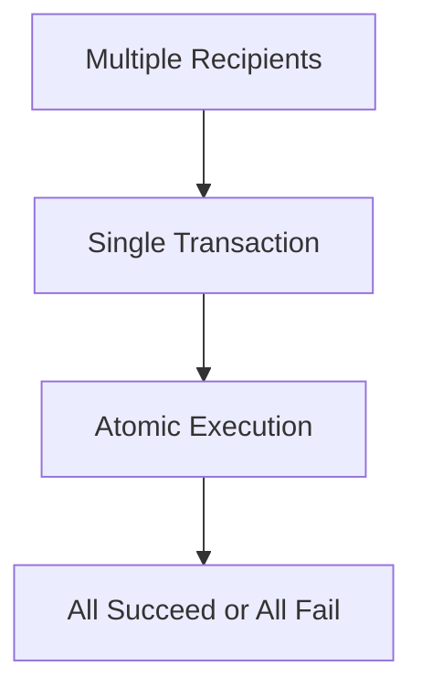

## Overview

Batch payments allow you to process multiple direct or conversion payments in a single blockchain transaction, significantly reducing gas costs and simplifying payment operations.

## How It Works

**Benefits:**
- **Gas Savings:** Up to 60% reduction in total gas costs
- **Atomic Operations:** All payments succeed or fail together
- **Simplified Management:** One transaction to monitor

## Requirements

- All payments must be on the same network
- Supports Native, ERC20, and Conversion payments
- Maximum batch size limited by block gas limit

## Use Cases

<CardGroup cols={2}>
  <Card title="Payroll Processing" icon="users">
    Pay multiple employees simultaneously
  </Card>
  
  <Card title="Vendor Payments" icon="building">
    Process multiple supplier invoices
  </Card>
</CardGroup>

## Used In

<CardGroup cols={2}>
  <Card title="Payroll" href="/use-cases/payroll" icon="money-bill-wave">
    Efficiently pay multiple employees in one transaction
  </Card>
  
  <Card title="Payouts" href="/use-cases/payouts" icon="hand-holding-dollar">
    Bulk vendor and supplier payments with gas savings
  </Card>
  
  <Card title="Invoicing" href="/use-cases/invoicing" icon="file-invoice">
    Pay multiple invoices simultaneously
  </Card>
  
  <Card title="Create Requests" href="/api-features/create-requests" icon="plus">
    Start by creating individual requests to batch together
  </Card>
</CardGroup>

## Implementation Details

See [API Reference - Batch Payments](/api-reference/batch-payments) for complete technical documentation.