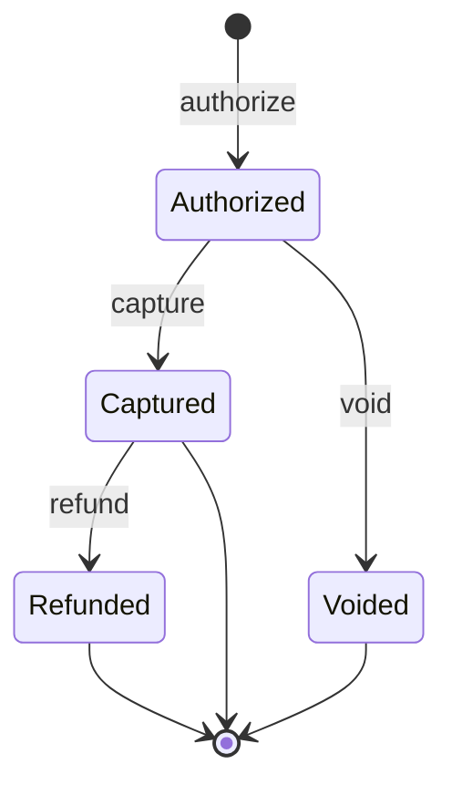

<Warning>
Commerce payments are in **preview** and may not be available on all accounts. Contact support if you're interested in this feature.
</Warning>

## Overview

Commerce payments implement an authorize-capture-void escrow pattern for e-commerce use cases. Funds are held in escrow after authorization and only transferred to the merchant upon capture.

This is useful for:
- **Marketplace platforms** — Hold funds until order fulfillment, then capture or void
- **Subscription trials** — Authorize a payment, capture only if the user converts
- **Pre-orders** — Reserve funds and capture when the product ships

## Payment Lifecycle

## Endpoints

All commerce payment endpoints are under `/v2/commerce-payments`.

### Authorize

Generate escrow authorization calldata and execute it.

1. `POST /v2/commerce-payments/authorize/calldata` — Get authorization transaction calldata
2. `POST /v2/commerce-payments/:requestId/authorize` — Execute authorization via smart account

### Capture

Transfer authorized funds to the merchant.

1. `POST /v2/commerce-payments/:requestId/capture/calldata` — Get capture transaction calldata
2. `POST /v2/commerce-payments/:requestId/capture` — Execute capture

### Void

Cancel an authorized payment and release escrowed funds.

1. `POST /v2/commerce-payments/:requestId/void/calldata` — Get void transaction calldata
2. `POST /v2/commerce-payments/:requestId/void` — Execute void

### Check Status

`GET /v2/commerce-payments/:requestId/status` — Get the current state of a commerce payment.

## Authentication

All endpoints require `x-api-key` or `x-client-id` authentication.

## Related Pages

<CardGroup cols={2}>
  <Card title="Secure Payment Pages" icon="lock" href="/api-features/secure-payment-pages">
    Hosted payment experience with smart account support.
  </Card>

  <Card title="Webhooks" icon="webhook" href="/api-features/webhooks-events">
    Receive real-time notifications for payment lifecycle events.
  </Card>
</CardGroup>
