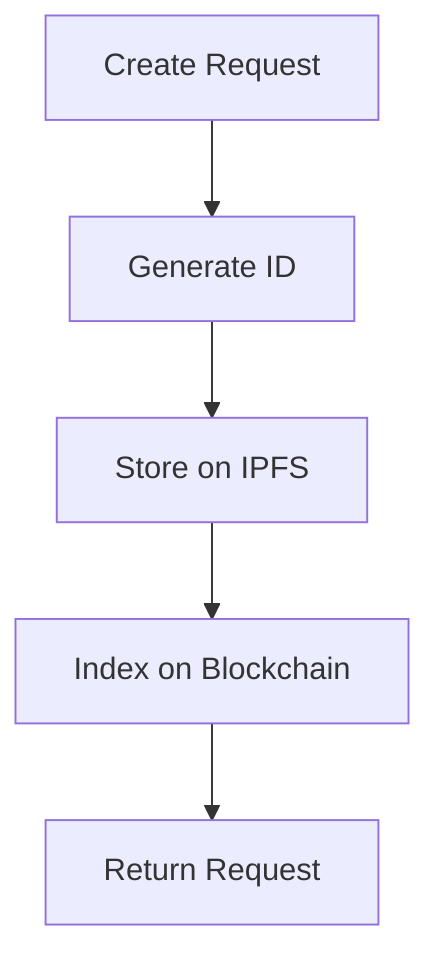

## Overview

Request creation and status querying form the foundation of Request Network operations, enabling invoice generation and payment tracking throughout the lifecycle.

## Request Creation

<CardGroup cols={2}>
  <Card title="Invoice Requests" icon="file-invoice">
    Traditional invoicing workflows
  </Card>
  
  <Card title="Payment Requests" icon="money-bill">
    Direct payment collection
  </Card>
</CardGroup>

## How It Works

**Process:**
1. **Create:** Submit request with payee, payer, and amount details
2. **Store:** Decentralized storage on IPFS
3. **Index:** Blockchain indexing for discovery
4. **Track:** Real-time status monitoring

## Request Properties

### Core Information
- **Payee:** Request creator/recipient
- **Payer:** Payment sender (optional)
- **Amount:** Payment amount and currency
- **Due Date:** Payment deadline

### Payment Configuration
- **Payment Network:** ERC20, ETH, or custom
- **Accepted Tokens:** Supported payment currencies
- **Conversion:** Fiat-denominated crypto payments

## Status Lifecycle

### Request States
- `created` - Request initialized
- `pending` - Awaiting payment
- `paid` - Payment completed
- `cancelled` - Request cancelled

### Payment States
- `no_payment` - No payment detected
- `partially_paid` - Partial payment received
- `paid` - Full payment completed
- `overpaid` - Payment exceeds requested amount

## Query Methods

<CardGroup cols={2}>
  <Card title="Single Request" icon="magnifying-glass">
    Get specific request by ID
  </Card>
  
  <Card title="Batch Queries" icon="list">
    Multiple requests in one call
  </Card>
</CardGroup>

## Real-time Updates

Combine with [Webhooks & Events](/api-features/webhooks-events) for instant status notifications.

## Implementation Details

See [API Reference - Requests](/api-reference/requests) for complete technical documentation.