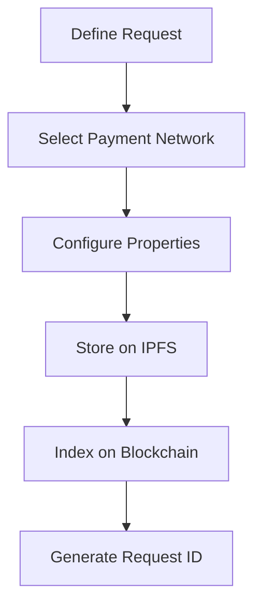

## Overview

Request creation forms the foundation of Request Network operations, enabling structured payment collection through invoice generation and payment request workflows.

## Request Types

<CardGroup cols={2}>
  <Card title="Invoice Requests" icon="file-invoice">
    Traditional invoicing with payee details
  </Card>
  
  <Card title="Payment Requests" icon="money-bill">
    Direct payment collection workflows
  </Card>
</CardGroup>

## How It Works

**Creation Process:**
1. **Define:** Set payee, payer, amount, and currency details
2. **Configure:** Choose payment network and accepted tokens
3. **Store:** Decentralized storage on IPFS
4. **Index:** Blockchain indexing for discovery
5. **Track:** Real-time status monitoring

## Request Properties

### Core Information
- **Payee:** Request creator/recipient address
- **Payer:** Payment sender address (optional)
- **Amount:** Payment amount and currency
- **Due Date:** Payment deadline (optional)

### Payment Configuration
- **Payment Network:** ERC20, ETH, or specialized networks
- **Accepted Tokens:** Supported payment currencies
- **Conversion Settings:** Fiat-denominated crypto payments

## Payment Network Selection

<CardGroup cols={2}>
  <Card title="ERC20 Networks" icon="coins">
    USDC, USDT, DAI token payments
  </Card>
  
  <Card title="Native Networks" icon="ethereum">
    ETH, MATIC, BNB direct payments
  </Card>
</CardGroup>

### Supported Networks
- **Mainnet:** Ethereum, Polygon, Arbitrum, Optimism
- **Sidechains:** BSC, Gnosis, Fantom, Avalanche
- **Testnets:** Sepolia, Mumbai for development

## Content Data

Attach additional information to requests:
- **Invoice Details:** Line items, tax information
- **Business Information:** Company details, terms
- **Custom Metadata:** Application-specific data

## Used In

<CardGroup cols={2}>
  <Card title="Invoicing" href="/use-cases/invoicing">
    Business invoice generation
  </Card>
  
  <Card title="Payroll" href="/use-cases/payroll">
    Employee payment requests
  </Card>
</CardGroup>

## Implementation Details

See [API Reference - Create Requests](/api-reference/endpoints/create-request) for complete technical documentation.