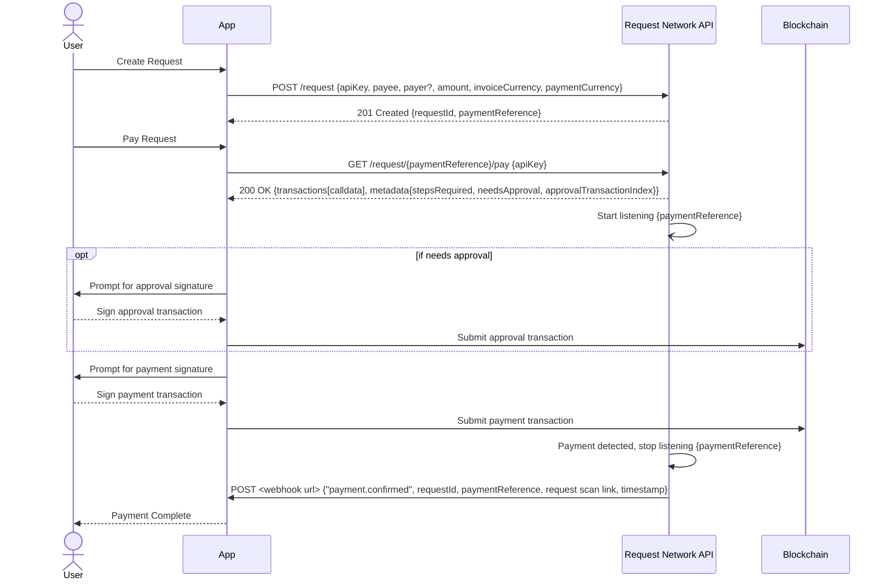

## Overview

Request creation forms the foundation of Request Network operations, enabling structured payment collection through invoice generation and payment request workflows.

## What You Can Do

At its core, the Request Network API empowers you to:

* **Create Requests:** Define payment requests with information such as payee, payer (optional), amount, currency, and recurrence (optional).
* **Facilitate Payments:** Return transaction calldata, ready to be signed by end-users and sent to the blockchain for secure and transparent value transfer.
* **Deliver Webhook Notifications:** Receive instant updates on payment status changes, enabling your application to react dynamically to completed transactions.
* **Partial Payment Support:** Pay a portion of a request instead of the full amount at once. This unlocks powerful use cases such as:
  * **Split payment:** Split a payment 50% USDC on Base and 50% with USDT on Optimism.
  * **Gradual payment plans:** Allow users to pay large invoices in smaller chunks.
  * **Risk mitigation:** Test with small amounts before completing large payments.

The API automatically tracks payment progress, showing `partially_paid` status until the request is fully paid, and prevents overpayment by capping amounts to the remaining balance.

## Workflows

### Invoice-first Workflow

Create a payment request first, then allow customers to pay at their convenience.

**Flow:**
1. Create request with payee, amount, and currency
2. Share request ID or payment reference with customer
3. Customer retrieves payment calldata
4. Customer executes transaction
5. Receive webhook confirmation

**Use Cases:** Professional invoicing, B2B payments, subscription billing

### Payment-first Workflow

Send payments directly without creating a request first using the `/payouts` endpoint.

**Flow:**
1. Call `/payouts` with payee and amount
2. Receive transaction calldata immediately
3. Execute transaction
4. Request is created and paid in one step

**Use Cases:** Vendor payments, contractor payouts, immediate transfers

## How It Works

The following diagram illustrates the typical flow for creating and paying requests using the Request Network API:


```mermaid
sequenceDiagram
    actor User
    participant App
    participant Request Network API
    participant Blockchain

    User->>App: Create Request
    App->>Request Network API: POST /request {apiKey, payee, payer?, amount, invoiceCurrency, paymentCurrency}
    Request Network API-->>App: 201 Created {requestId, paymentReference}

    User->>App: Pay Request
    App->>Request Network API: GET /request/{paymentReference}/pay {apiKey}
    Request Network API-->>App: 200 OK {transactions[calldata], metadata{stepsRequired, needsApproval, approvalTransactionIndex}}
    Request Network API-)Request Network API: Start listening {paymentReference}

    opt if needs approval 
        App->>User: Prompt for approval signature
        User-->>App: Sign approval transaction
        App->>Blockchain: Submit approval transaction
    end

    App->>User: Prompt for payment signature
    User-->>App: Sign payment transaction
    App->>Blockchain: Submit payment transaction

    Request Network API->>Request Network API: Payment detected, stop listening {paymentReference}
    Request Network API->>App: POST <webhook url> {"payment.confirmed", requestId, paymentReference, request scan link, timestamp}
    App-->>User: Payment Complete
```

## Request Properties

### Core Information

* **Payee:** The wallet address of the payee (Ethereum 0x... or TRON T...). Required for all requests except crypto-to-fiat.
* **Payer:** The wallet address of the payer (optional)
* **Amount:** The payable amount of the invoice, in human readable format
* **Invoice Currency:** Invoice Currency ID, from the [Request Network Token List](/resources/token-list) e.g: USD
* **Payment Currency:** Payment currency ID, from the [Request Network Token List](/resources/token-list) e.g: ETH-sepolia-sepolia

### Optional Configuration

* **Recurrence:** For recurring payments, specify start date and frequency (DAILY, WEEKLY, MONTHLY, YEARLY)
* **Fee Settings:** Specify fee percentage and fee address for platform fee collection

### Supported Chains and Currencies

See [Supported Chains and Currencies](/resources/supported-chains-and-currencies) for the complete list of available networks and tokens.

## Quick Example

Here's a simple example of creating a request:

```javascript
const response = await fetch('https://api.request.network/v2/request', {
  method: 'POST',
  headers: {
    'X-Api-Key': process.env.RN_API_KEY,
    'Content-Type': 'application/json'
  },
  body: JSON.stringify({
    payee: '0x...',
    amount: '100',
    invoiceCurrency: 'USD',
    paymentCurrency: 'USDC-base-base'
  })
});

const { requestId, paymentReference } = await response.json();
```

Then get the payment calldata:

```javascript
const payResponse = await fetch(
  `https://api.request.network/v2/request/${paymentReference}/pay`,
  {
    headers: { 'X-Api-Key': process.env.RN_API_KEY }
  }
);

const { transactions, metadata } = await payResponse.json();
// Execute transactions with your wallet...
```

For a complete working example, see the [Integration Tutorial](/api-setup/integration-tutorial).

## Used In

<CardGroup cols={2}>
  <Card title="Invoicing" href="/use-cases/invoicing">
    Business invoice generation
  </Card>
  
  <Card title="Checkout" href="/use-cases/checkout">
    Payment collection at checkout
  </Card>

  <Card title="Integration Tutorial" href="/api-setup/integration-tutorial">
    Complete implementation example
  </Card>

  <Card title="Recurring Payments" href="/api-features/recurring-payments">
    Subscription and billing workflows
  </Card>
</CardGroup>

### Key Features

* **Human-readable amounts:** Send amounts in standard format (e.g., "0.1"), no BigNumber conversions needed
* **Automatic payment tracking:** Real-time status updates via webhooks
* **Flexible currencies:** Request in one currency, pay in another with automatic conversion
* **Partial payments:** Track multiple payments against a single request

See [API Reference](https://api.request.network/open-api) for complete technical documentation with OpenAPI specs.
