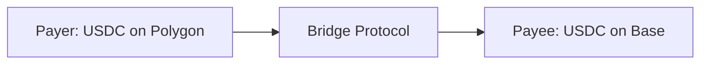

## Overview

Crosschain payments enable seamless transactions across different blockchain networks, allowing payers to send from their preferred chain while payees receive on their preferred network.

## How It Works

**Benefits:**
- Access to funds across multiple chains
- Automatic routing optimization  
- No manual bridging required

## Samechain Payments

A special case of crosschain infrastructure that converts currencies on the same network (e.g., ETH → USDC on Ethereum).

## Supported Networks

<CardGroup cols={2}>
  <Card title="Layer 1" icon="link">
    Ethereum, BSC, Avalanche, Fantom
  </Card>
  
  <Card title="Layer 2" icon="layers">
    Polygon, Arbitrum, Base, Optimism
  </Card>
</CardGroup>

## Bridge Protocols

- **LayerZero:** Ultra Light Node security
- **Stargate:** Liquidity-based bridging
- **Automatic Selection:** Optimal route chosen

## Used In

<CardGroup cols={4}>
  <Card title="Checkout" href="/use-cases/checkout">
    Flexible payment options
  </Card>
  
  <Card title="Invoicing" href="/use-cases/invoicing">
    Accept from any chain
  </Card>
  
  <Card title="Payouts" href="/use-cases/payouts">
    Send to preferred networks
  </Card>
  
  <Card title="Payroll" href="/use-cases/payroll">
    Multi-chain employee payments
  </Card>
</CardGroup>

## Implementation Details

See [API Reference - Crosschain Payments](/api-reference/crosschain-payments) for complete technical documentation.