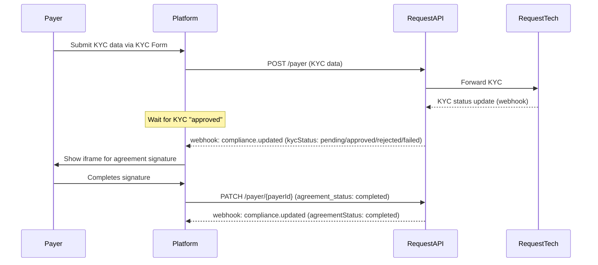
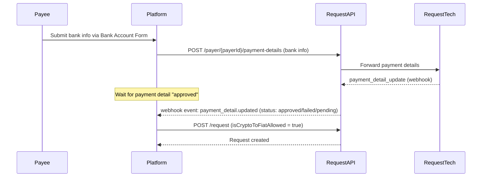
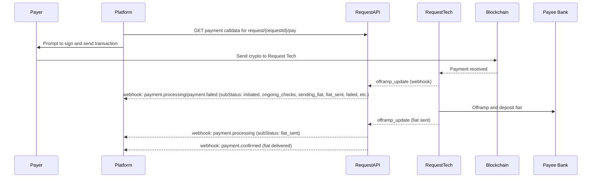

# Crypto-to-fiat Payments

Crypto-to-fiat payments allow a Payer to pay a Request in cryptocurrency, while the Payee receives fiat currency directly in their bank account. This is achieved by combining the Request Network crypto payment with [Request Tech](https://www.request.finance/tech) offramp infrastructure. This requires prerequisite compliance (KYC/Agreement) and bank account registration (payment detail) flows.

[EasyInvoice](/request-network-api/easyinvoice-api-demo-app) includes a reference implementation for this flow.

<Info>
Crypto-to-fiat payments are only available in version 2 of the Request Network API.
</Info>

## Getting Started with Crypto-to-fiat Payments

### Sandbox Access - Get Started Today

All developers can immediately access the **Crypto-to-fiat Sandbox** to build and test their integration:

1. **Create an account** on the [Request Network API Portal](https://portal.request.network/)
2. **Generate a Sandbox API key** with crypto-to-fiat sandbox access
3. **Start building** with Sepolia testnet USDC, simulated KYC, and mock bank accounts

The sandbox provides a complete testing environment where you can:

* Test the full crypto-to-fiat flow without real funds
* Simulate payer KYC verification using [mock documents](https://docs.sumsub.com/docs/verification-document-templates)
* Work with mock bank account data and fiat payment status

<Warning>
I**mportant: Other Payment Types Use Real Funds**

The "Crypto-to-fiat Sandbox" setting for API keys only affects crypto-to-fiat payments. Other payment types can process *real* funds with any API key, even Sandbox API keys.
</Warning>

### Production Access - Launch When Ready

When you're ready to go live with real transactions:

1. [**Get in touch**](https://2deywy.share-eu1.hsforms.com/2b92phs9LR_eJdeZoxzmoMA?utm_source=request.network\&utm_medium=docs\&utm_campaign=evergreen\&utm_content=get_in_touch) to request production access
2. **Discuss your use case** with our team to ensure the best integration approach
3. **Complete the approval process** - we'll work with you to get everything set up
4. **Generate Production API keys** once approved

Production access includes:

* Real USDC transactions on mainnet
* Actual KYC verification for payers
* Live bank account validation
* Fiat deposits to real bank accounts

### Crypto-to-fiat Supported Chains and Currencies

For Crypto-to-fiat Payments, the Request Network API supports USDC on Ethereum, Polygon, Arbitrum One, and Sepolia.

<Info>
**Crypto-to-fiat Payment with non-USDC currencies:**

While crypto-to-fiat requests must be created in USDC, users can pay in alternative currencies through a four-step process, using [crosschain-payments](/api-features/crosschain-payments):

1. **Create Crosschain Request**: Create a request to swap the payer's currency (e.g., ETH on Ethereum) to USDC on the target chain (e.g., USDC on Polygon). Note: Don't specify a payer address during request creation to allow flexibility in who can pay.
2. **Pay Crosschain Request**: Execute the crosschain payment to fulfill the first request
3. **Create Crypto-to-Fiat Request**: Create a separate request for the USDC offramp to fiat and bank deposit
4. **Pay Crypto-to-Fiat Request**: Execute the crypto-to-fiat payment to complete the flow

This four-step approach is required due to current API limitations - more streamlined flows are not yet implemented.
</Info>

## Understanding `clientUserId`

Many `/payer` endpoints in the Request Network API require a `clientUserId` as a path parameter. This value is an **arbitrary identifier** chosen by your platform to represent a user (the payer) in your own system.

* **You control the format:** The `clientUserId` can be any unique string that makes sense for your application. It can be a UUID, email address, database ID, or anything unique per user on your platform.
* **EasyInvoice Example:** In the EasyInvoice demo app, `clientUserId` is set to the user's email address.
* **Why is this useful?** This approach allows you to integrate the Request Network API without having to change your existing user management logic. You simply pass your own identifier to the API, and all payer-related compliance, agreement, and payment detail records will be associated with that value.

**Example usage:**

```
GET /v2/payer/{clientUserId}
PATCH /v2/payer/{clientUserId}
POST /v2/payer/{clientUserId}/payment-details
GET  /v2/payer/{clientUserId}/payment-details
```

In each case, replace `{clientUserId}` with your chosen identifier for the user.

## Compliance & Payer Onboarding

Before a payer can use crypto-to-fiat, they must complete compliance steps:

* **KYC**: The payer must submit a KYC application.
* **Agreement**: The payer must sign a compliance agreement (via an iframe flow).
* **Bank Account**: The payee's bank account must be associated with a payer for compliance reasons, even though the payee owns the account.

### **Compliance Flow Diagram**



### **Flow Explanation**

1. **Submit KYC**: The platform collects KYC information from the payer and submits it to the API.
2. **KYC Review**: The platform receives webhook updates as the KYC is processed (`compliance.updated` with `kycStatus`).
3. **Agreement Signature**: The platform displays an iframe for the payer to sign the compliance agreement. Once signed, the platform calls the API to update the agreement status.
4. **Agreement Confirmation**: The platform receives a webhook update when the agreement is completed (`compliance.updated` with `agreementStatus`).

### Relevant Endpoints

* `POST /payer`: Submit KYC application.
* `GET /payer/{clientUserId}`: Get compliance status for a payer.
* `PATCH /payer/{clientUserId}`: Update agreement status after signature.

## Create compliance data for a user

> Checks compliance status and returns necessary URLs for completing compliance.

Endpoint reference: [POST /v2/payer](https://api.request.network/open-api/#tag/v2payer/POST/v2/payer)

## Get compliance status for a user

> Retrieves the comprehensive compliance status for a specific user, including KYC and agreement status.

Endpoint reference: [GET /v2/payer/{clientUserId}](https://api.request.network/open-api/#tag/v2payer/GET/v2/payer/{clientUserId})

## Update agreement status

> Update the agreement completion status for a user.

Endpoint reference: [PATCH /v2/payer/{clientUserId}](https://api.request.network/open-api/#tag/v2payer/PATCH/v2/payer/{clientUserId})

## Setting Up a Crypto-to-Fiat Request (Payee Flow)

Before a payer can pay in crypto and the payee can receive fiat, the platform must:

* **Submit the payee’s bank account details** (associated with a payer for compliance).
* **Wait for approval** of those payment details (usually less than 60 seconds, confirmed via webhook).
* **Create a new request** with `isCryptoToFiatAllowed = true`.

### **Payment Details Flow Diagram**



### **Flow Explanation**

1. **Submit Bank Account**: The platform submits the payee’s bank account details, associating them with a payer. The Request Network API forwards these details to the offramp provider (Request Tech).
2. **Approval**: The platform receives a webhook (`payment_detail.updated`) indicating if the payment details are approved, failed, or pending.
3. **Create Request**: Once approved, the platform creates a new request as usual, but with the `isCryptoToFiatAllowed` flag set to `true`. This signals that the request is eligible for crypto-to-fiat payment.

### **Design Rationale & UX Constraints**

While it is technically possible to create a crypto-to-fiat request before the payer has completed KYC, EasyInvoice intentionally requires the payer to complete KYC first. This decision is based on several practical and UX considerations:

* **Bank Account Association:** The payee’s bank account ("payment details") must be linked to a specific payer, which can only be done after the payer completes KYC. This ensures compliance and accurate association of payment details.
* **Validation Complexity:** Although the payee could submit their bank account details in advance, the platform cannot validate or approve these details until the payer’s KYC is complete. This would introduce additional communication steps and potential confusion.
* **UI Simplicity:** EasyInvoice integrates payee bank account registration directly into the Create Invoice form. If the user clicks "Create" before the bank account is approved, a loading indicator appears until approval is granted. This avoids the need for a separate bank account management page and keeps the user experience straightforward.
* **Protocol Fit**: The crypto-to-fiat feature is integrated at the API level, not at the Request Network protocol level. Creating a request on the protocol does not require bank account details, because the protocol itself only handles crypto payments. The additional bank account and offramp logic is layered on top via the API, which transfers crypto to Request Tech, who then executes the offramp and sends fiat to the payee’s bank account. This separation adds some complexity, so the UI is intentionally kept simple.
* **Future Flexibility:** While some clients may want to allow payees to create requests before payer KYC, this is not currently supported in EasyInvoice to avoid increased complexity. We may revisit this if there is sufficient market demand.

This approach ensures a smooth, compliant, and user-friendly experience, even if it means some technical possibilities are not exposed in the current UI.

### Relevant Endpoints

* `POST /payer/{clientUserId}/payment-details`: Create payment details (register bank account) for a payee.
* `GET /payer/{clientUserId}/payment-details`: Get payment details (bank accounts) for a payee.
* `POST /v2/request` with `isCryptoToFiatAllowed = true`: Create a new crypto-to-fiat request

## Create payment details

> Create payment details for a user

Endpoint reference: [POST /v2/payer/{clientUserId}/payment-details](https://api.request.network/open-api/#tag/v2payer/POST/v2/payer/{clientUserId}/payment-details)

## Get payment details for a user

> Retrieves the registered bank account details for a user. Optionally filter by payment details ID.

Endpoint reference: [GET /v2/payer/{clientUserId}/payment-details](https://api.request.network/open-api/#tag/v2payer/GET/v2/payer/{clientUserId}/payment-details)

## Create a new request

> Create a new payment request

Endpoint reference: [POST /v2/request](https://api.request.network/open-api/#tag/v2request/POST/v2/request)

## Paying a Crypto-to-Fiat Request

The payer pays in crypto; Request Tech handles offramping and fiat payout.

### **Payment Flow Diagram**



**Flow Explanation**

1. **Get Payment Calldata**: The platform fetches payment calldata for the request.
2. **User Pays**: The payer signs and submits the transaction, sending crypto to Request Tech.
3. **Offramp Processing**: Request Tech receives the crypto and begins the offramp process.
4. **Status Updates**: The platform receives webhook events as the offramp progresses (`payment.processing`, `payment.failed`), with `subStatus` indicating the current offramp stage.
5. **Fiat Delivered**: When the offramp is complete, the platform receives a final webhook (`payment.processing` with `subStatus: fiat_sent`), and then a `payment.confirmed` event.

## Crypto-to-fiat Webhook Event Reference

|                          |                                        |                                                                                                                                                                                                                                                                                                         |
| ------------------------ | -------------------------------------- | ------------------------------------------------------------------------------------------------------------------------------------------------------------------------------------------------------------------------------------------------------------------------------------------------------- |
| Event                    | Description                            | subStatus values (if any)                                                                                                                                                                                                                                                                               |
| `compliance.updated`     | KYC/Agreement status updates           | `kycStatus`: `initiated`, `pending`, `approved`, `rejected`, `failed`; `agreementStatus`: `not_started`, `pending`, `completed`, `rejected`, `failed` |
| `payment_detail.updated` | Payment detail (bank account) status   | `approved`, `failed`, `pending`                                                                                                                                                                                                                                                                         |
| `payment.processing`     | Offramp in progress                    | `initiated`, `pending_internal_assessment`, `ongoing_checks`, `sending_fiat`, `fiat_sent`, `bounced`, `retry_required`                                                                                                                                                                                  |
| `payment.failed`         | Offramp or payment failed              | `failed`, `bounced`                                                                                                                                                                                                                                                                                     |
| `payment.confirmed`      | Payment fully settled (fiat delivered) |                                                                                                                                                                                                                                                                                                         |
