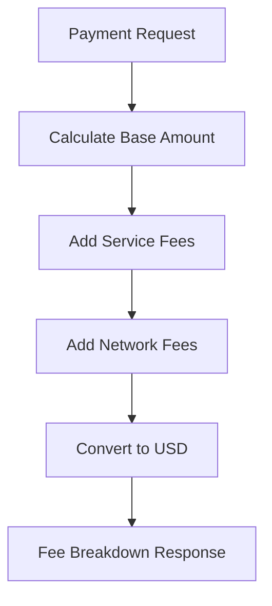

## Overview

Detailed fee breakdowns provide complete transparency into all costs associated with payments, including network fees, service fees, and USD equivalent amounts for better financial planning.

## Fee Components

<CardGroup cols={2}>
  <Card title="Network Fees" icon="network-wired">
    Blockchain transaction costs
  </Card>
  
  <Card title="Service Fees" icon="handshake">
    Platform and processing fees
  </Card>
</CardGroup>

## How It Works



**Calculation Process:**
1. **Base Amount:** Original payment amount
2. **Service Fees:** Platform and custom fees
3. **Network Fees:** Gas and transaction costs
4. **USD Conversion:** Real-time exchange rates
5. **Breakdown:** Itemized fee structure

## Fee Categories

### Platform Fees
- **Request Network Fee:** Protocol usage fee
- **API Service Fee:** Request API processing fee
- **Custom Fees:** Application-specific charges

### Network Fees
- **Gas Fees:** Transaction execution costs
- **Bridge Fees:** Cross-chain transfer costs
- **Token Conversion:** DEX swap fees

## USD Amount Calculations

### Real-time Conversion
- **Live Rates:** Current market exchange rates
- **Historical Rates:** Rates at payment time
- **Multi-currency:** Support for various fiat currencies

### Breakdown Format
```json
{
  "baseAmount": {
    "crypto": "100 USDC",
    "usd": "$100.00"
  },
  "fees": {
    "network": {
      "crypto": "0.25 USDC",
      "usd": "$0.25"
    },
    "service": {
      "crypto": "2.5 USDC", 
      "usd": "$2.50"
    }
  },
  "total": {
    "crypto": "102.75 USDC",
    "usd": "$102.75"
  }
}
```

## Integration Points

<CardGroup cols={2}>
  <Card title="Payment Routes" icon="route">
    Fee estimates for payment routing
  </Card>
  
  <Card title="Payment Queries" icon="magnifying-glass">
    Historical fee information
  </Card>
</CardGroup>

## Available Endpoints

Fee breakdowns are included in:
- **Payment route calculations**
- **GET /payments responses**
- **Request creation responses**
- **Payment status updates**

## Implementation Details

See [API Reference - Fee Breakdowns](/api-reference/fee-breakdowns) for complete technical documentation.