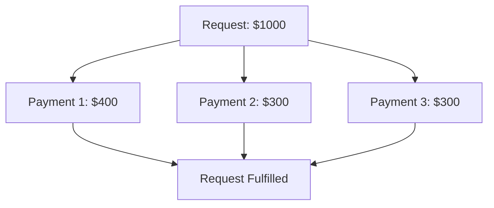

## Overview

Partial payments allow requests to be fulfilled through multiple transactions, enabling split payments, installment plans, and flexible funding approaches.

<Tip>
**Flexible invoice payments:** Enable customers to pay invoices in installments or from multiple wallets. Combine with [conversion payments](/api-features/conversion-payments) for fiat-denominated installment plans. See examples in our [Invoicing use case](/use-cases/invoicing).
</Tip>

## How It Works

**Benefits:**
- **Flexible Payment Plans:** Installments and split payments
- **Multiple Funding Sources:** Different wallets, chains, or currencies
- **Risk Management:** Partial fulfillment tracking

## Use Cases

<CardGroup cols={2}>
  <Card title="Installment Plans" icon="calendar">
    Break large payments into smaller amounts
  </Card>
  
  <Card title="Multiple Funders" icon="users">
    Group payments or shared expenses
  </Card>
</CardGroup>

## Supported Payment Types

Works with all payment types except Crypto-to-fiat payments:
- Native & ERC20 payments
- Conversion payments  
- Crosschain payments
- Batch payments

## Used In

<CardGroup cols={3}>
  <Card title="Invoicing" href="/use-cases/invoicing" icon="file-invoice">
    Enable installment plans for large invoices
  </Card>
  
  <Card title="Checkout" href="/use-cases/checkout" icon="cart-shopping">
    Flexible payment options for e-commerce
  </Card>
  
  <Card title="Subscriptions" href="/use-cases/subscriptions" icon="repeat">
    Allow partial subscription payments
  </Card>
</CardGroup>

## Implementation Details

See [API Reference - Partial Payments](/api-reference/partial-payments) for complete technical documentation.