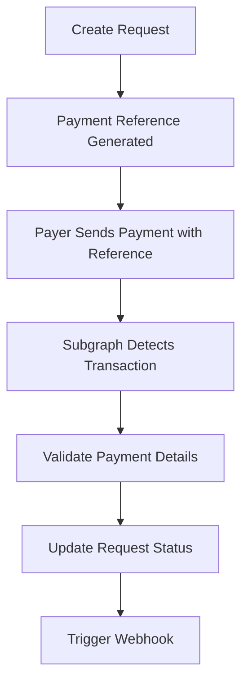

## Overview

The Request Network API uses a **reference-based payment detection system** that automatically monitors blockchain transactions to detect when payments are made to your requests. This system works across multiple blockchains and handles various payment scenarios with zero configuration required.

## How It Works

### 1. Payment Reference Generation

When you create a payment request, the API automatically generates a unique **payment reference** — a 16-character identifier that acts as a fingerprint for your request. This reference is what connects blockchain transactions back to your specific request.

**Example:** `0x1234567890abcdef`

### 2. Blockchain Monitoring

The API continuously monitors supported blockchains using subgraphs that scan for transactions containing payment references. This happens automatically in the background with no action required from you.

**Monitoring includes:**
- Real-time transaction scanning
- Multi-network support
- Payment reference matching
- Amount and currency validation

### 3. Automatic Detection

When someone makes a payment and includes the payment reference in their transaction, the system:

- **Detects** the transaction within minutes
- **Validates** payment details (amount, currency, recipient)
- **Updates** request status (pending → partially paid → fully paid)
- **Triggers** your configured webhooks

### 4. Real-time Status Updates

Once a payment is detected, your request status is immediately updated and you can get the latest information via:

- **API Queries:** GET requests to check payment status using the request ID
- **Webhooks:** Automatically receive updates to your configured webhook endpoints

## Supported Networks

Payment detection works across all Request Network supported chains:

### Mainnet Networks
- Ethereum, Polygon (Matic), Arbitrum One, Optimism, Base
- Gnosis Chain, BSC, Fantom, Avalanche, Celo

### Testnet Networks
- Sepolia, Base Sepolia, Arbitrum Sepolia, Optimism Sepolia

## Cross-chain Payment Detection

All cross-chain payments using the Request Network API use the **ERC-20 Fee Proxy contract** as the final payment leg, ensuring payment detection works seamlessly across chains.

**How it works:**
1. Payer initiates payment on source chain (e.g., Polygon)
2. Cross-chain bridge transfers funds to destination chain (e.g., Base)
3. Final payment uses ERC-20 Fee Proxy with payment reference
4. Payment detection system identifies the transaction
5. Request status updated automatically

## Webhook Notifications

Configure webhooks to receive real-time notifications for payment events:

<CardGroup cols={2}>
  <Card title="Payment Confirmed" icon="circle-check">
    Full payment received and confirmed on blockchain
  </Card>
  
  <Card title="Payment Partial" icon="circle-half-stroke">
    Partial payment received (less than expected amount)
  </Card>
  
  <Card title="Payment Failed" icon="circle-xmark">
    Payment transaction failed or reverted
  </Card>
  
  <Card title="Payment Refunded" icon="arrow-rotate-left">
    Payment was refunded to the payer
  </Card>
</CardGroup>

This allows your application to react immediately to payment events without constantly polling the API.

## Integration Benefits

<CardGroup cols={2}>
  <Card title="Zero Configuration" icon="magic-wand-sparkles">
    Payment detection happens automatically — no setup required
  </Card>
  
  <Card title="Multi-blockchain" icon="link">
    Works across all 10+ supported EVM networks
  </Card>
  
  <Card title="Real-time Updates" icon="bolt">
    Fast detection and status updates within minutes
  </Card>
  
  <Card title="Reliable Infrastructure" icon="shield-check">
    Built on proven blockchain indexing infrastructure
  </Card>
</CardGroup>

## Payment States

Requests progress through the following payment states:

- **`created`** - Request created, awaiting payment
- **`pending`** - Payment transaction detected, awaiting confirmations
- **`partially_paid`** - Partial payment received
- **`paid`** - Full payment received and confirmed
- **`overpaid`** - Payment exceeds expected amount
- **`refunded`** - Payment was refunded

## What's Next?

<CardGroup cols={3}>
  <Card 
    title="Webhooks" 
    href="/api-features/webhooks-events"
    icon="webhook"
  >
    Configure webhook notifications for payment events
  </Card>
  
  <Card 
    title="Query Payments" 
    href="/api-features/query-payments"
    icon="magnifying-glass"
  >
    Manually check payment status via API
  </Card>
  
  <Card 
    title="Supported Chains" 
    href="/resources/supported-chains-and-currencies"
    icon="globe"
  >
    View all supported networks and currencies
  </Card>
</CardGroup>