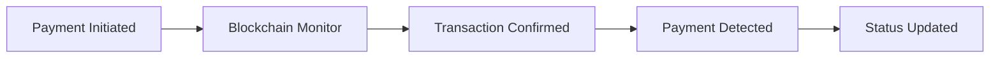

## Overview

Payment detection automatically monitors blockchain networks to verify when payments are completed, providing real-time status updates without manual verification.

## Detection Methods

<CardGroup cols={2}>
  <Card title="Blockchain Scanning" icon="magnifying-glass">
    Direct network monitoring
  </Card>
  
  <Card title="Event Listening" icon="bell">
    Smart contract event detection
  </Card>
</CardGroup>

## How It Works

**Process:**
1. **Monitor:** Continuous blockchain scanning
2. **Detect:** Payment transaction identification
3. **Verify:** Confirmation count validation
4. **Update:** Real-time status synchronization

## Supported Networks

### Mainnet Networks
- Ethereum, Polygon, Arbitrum, Optimism
- Gnosis, BSC, Fantom, Avalanche

### Testnet Networks
- Sepolia, Mumbai, Arbitrum Goerli

## Detection Features

### Real-time Updates
- **Instant Detection:** Sub-second payment identification
- **Confirmation Tracking:** Block confirmation monitoring
- **Status Webhooks:** Automatic notifications

### Multi-currency Support
- **Native Tokens:** ETH, MATIC, BNB, AVAX
- **ERC20 Tokens:** USDC, USDT, DAI, and more
- **Custom Tokens:** Any ERC20-compatible token

## Integration Points

<CardGroup cols={2}>
  <Card title="Webhooks" href="/api-features/webhooks-events">
    Automated payment notifications
  </Card>
  
  <Card title="Query Payments" href="/api-features/query-payments">
    Manual payment status checking
  </Card>
</CardGroup>

## Implementation Details

See [API Reference - Payment Detection](/api-reference/payment-detection) for complete technical documentation.