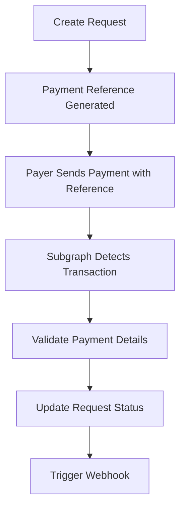

## Overview

The Request Network API uses a **reference-based payment detection system** that automatically monitors blockchain transactions to detect when payments are made to your requests.

This works across supported blockchains and handles payment matching automatically.

## How It Works

```mermaid
graph TD
    A[Create Request] --> B[Payment Reference Generated]
    B --> C[Payer Sends Payment with Reference]
    C --> D[Subgraph Detects Transaction]
    D --> E[Validate Payment Details]
    E --> F[Update Request Status]
    F --> G[Trigger Webhook]
```

### 1. Payment Reference Generation

When you create a request, the API automatically generates a unique **payment reference** (16-character identifier). This reference is what links on-chain payment transactions to your request.

**Example:** `0x1234567890abcdef`

### 2. Blockchain Monitoring

The API continuously monitors supported blockchains using subgraphs that scan for transactions containing payment references. This happens automatically in the background.

**Monitoring includes:**
- transaction scanning
- payment reference matching
- amount and currency validation

### 3. Automatic Detection

When someone makes a payment and includes the payment reference in their transaction, the system:

- **Detects** the transaction
- **Validates** payment details (amount, currency, recipient)
- **Updates** request status (for example partially paid or fully paid)
- **Triggers** your configured webhooks

### 4. Real-time Status Updates

Once a payment is detected, your request status is updated and you can retrieve the latest information via:

- **API Queries:** `GET /v2/request/{requestId}`
- **Webhooks:** receive updates on your configured endpoints

For the latest chain and currency support, see [Supported Chains and Currencies](/resources/supported-chains-and-currencies).

## Crosschain Payment Detection

All crosschain payments using Request Network API use the **ERC-20 Fee Proxy contract** as the last payment leg, so payment detection works out of the box.

**How it works:**
1. Payer initiates payment on source chain (e.g., Polygon)
2. Crosschain bridge transfers funds to destination chain (e.g., Base)
3. Final payment uses ERC-20 Fee Proxy with payment reference
4. Payment detection system identifies the transaction
5. Request status updated automatically

## Webhook Notifications

Configure webhooks to receive real-time notifications for payment events:

<CardGroup cols={2}>
  <Card title="Payment Confirmed" icon="circle-check">
    Full payment received and confirmed on blockchain
  </Card>
  
  <Card title="Payment Partial" icon="circle-half-stroke">
    Partial payment received (less than expected amount)
  </Card>
  
  <Card title="Payment Failed" icon="circle-xmark">
    Payment transaction failed or reverted
  </Card>
  
  <Card title="Payment Refunded" icon="arrow-rotate-left">
    Payment was refunded to the payer
  </Card>
</CardGroup>

This allows your application to react immediately to payment events without constantly polling the API.

## Integration Benefits

<CardGroup cols={2}>
  <Card title="Zero Configuration" icon="magic-wand-sparkles">
    Payment detection happens automatically
  </Card>
  
  <Card title="Multi-blockchain" icon="link">
    Works across supported chains
  </Card>
  
  <Card title="Real-time Updates" icon="bolt">
    Fast detection and status updates
  </Card>
  
  <Card title="Reliable Infrastructure" icon="shield-check">
    Built on blockchain indexing infrastructure
  </Card>
</CardGroup>

## What's Next?

<CardGroup cols={3}>
  <Card 
    title="Webhooks" 
    href="/api-features/webhooks-events"
    icon="webhook"
  >
    Configure webhook notifications for payment events
  </Card>
  
  <Card 
    title="Query Payments" 
    href="/api-features/query-payments"
    icon="magnifying-glass"
  >
    Manually check payment status via API
  </Card>
  
  <Card 
    title="Supported Chains" 
    href="/resources/supported-chains-and-currencies"
    icon="globe"
  >
    View all supported networks and currencies
  </Card>
</CardGroup>
