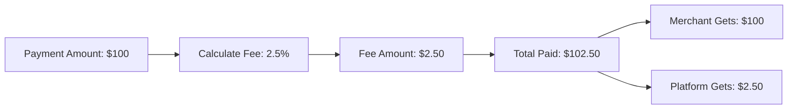

<Warning>
**AI-Generated Content** – This page was generated with AI assistance and may contain inaccuracies. While likely close to accurate, please verify critical details with the [stable documentation](https://docs.request.network) or [contact support](https://github.com/orgs/RequestNetwork/discussions).
</Warning>

## Overview

Platform fees enable service providers to collect their own fees from payment requests. The Request Network API supports percentage-based fees that are automatically calculated and collected during payment.

## How It Works



**Fee Collection:**
- **Automatic:** Fees calculated and collected during payment
- **Percentage-Based:** Platform defines `feePercentage` at payment time
- **Smart Contract Level:** API converts percentage to fixed `feeAmount` for smart contract
- **Separate Recipient:** Fees sent to specified `feeAddress`

## Fee Configuration

Platform fees are configured when initiating a payment via:
- `POST /v2/request/{requestId}/pay` - For request-based payments
- `POST /v2/payouts` - For direct payouts

### Fee Parameters

<ParamField body="feePercentage" type="string">
  Fee percentage to apply at payment time (e.g., '2.5' for 2.5%)
</ParamField>

<ParamField body="feeAddress" type="string">
  Ethereum address to receive the platform fee
</ParamField>

## Implementation

### Request-Based Payment with Fee

```javascript
// Step 1: Create a payment request
const createResponse = await fetch('https://api.request.network/v2/request', {
  method: 'POST',
  headers: {
    'Authorization': `Bearer ${apiKey}`,
    'Content-Type': 'application/json'
  },
  body: JSON.stringify({
    amount: '100',
    invoiceCurrency: 'USD',
    paymentCurrency: 'USDC-matic',
    payee: merchantAddress
  })
});

const { requestId } = await createResponse.json();

// Step 2: Initiate payment with platform fee
const payResponse = await fetch(`https://api.request.network/v2/request/${requestId}/pay`, {
  method: 'POST',
  headers: {
    'Authorization': `Bearer ${apiKey}`,
    'Content-Type': 'application/json'
  },
  body: JSON.stringify({
    feePercentage: '2.5',           // 2.5% platform fee
    feeAddress: platformFeeAddress  // Your platform's fee collection address
  })
});
```

### Direct Payout with Fee

```javascript
// Direct payout with platform fee
const payoutResponse = await fetch('https://api.request.network/v2/payouts', {
  method: 'POST',
  headers: {
    'Authorization': `Bearer ${apiKey}`,
    'Content-Type': 'application/json'
  },
  body: JSON.stringify({
    amount: '100',
    invoiceCurrency: 'USD',
    paymentCurrency: 'USDC-matic',
    payee: vendorAddress,
    feePercentage: '2.5',           // 2.5% platform fee
    feeAddress: platformFeeAddress  // Your platform's fee collection address
  })
});
```

## Fee Calculation

The API automatically handles the conversion from percentage to fixed amount:

1. **Platform specifies:** `feePercentage: '2.5'` (2.5%)
2. **API calculates:** For $100 payment → $2.50 fee
3. **Smart contract receives:** `feeAmount: '2500000'` (in token decimals)
4. **Total transaction:** $102.50 (merchant gets $100, platform gets $2.50)

## Use Cases

<CardGroup cols={2}>
  <Card title="SaaS Platforms" icon="building">
    Collect commission on customer payments processed through your platform
  </Card>
  
  <Card title="Payment Processors" icon="credit-card">
    Add processing fees to cover operational costs and generate revenue
  </Card>
  <Card title="Marketplaces" icon="store">
    Collect marketplace fees from vendor transactions
  </Card>
  
  <Card title="Service Platforms" icon="handshake">
    Monetize payment infrastructure for your users
  </Card>
</CardGroup>

## Fee Transparency

Fee amounts are included in payment responses and can be queried for complete transparency:

- Payment calldata includes calculated fee amount
- Payment status includes fee breakdown
- Fee amounts shown in both crypto and USD equivalents (where applicable)

## Important Notes

<Note>
**API vs Smart Contract Level**

- **API Level:** You specify `feePercentage` (e.g., "2.5") and `feeAddress`
- **Smart Contract Level:** API calculates and sends fixed `feeAmount` in token units
- **Your integration:** Only needs to handle percentage-based fees via API
</Note>

<Warning>
**Fee Address Validation**

Ensure the `feeAddress` is a valid Ethereum address that you control. Fees are sent automatically and cannot be recovered if sent to an incorrect address.
</Warning>

## What's Next?

<CardGroup cols={3}>
  <Card 
    title="Fee Breakdowns" 
    href="/api-features/fee-breakdowns"
    icon="receipt"
  >
    View detailed fee breakdown information
  </Card>
  
  <Card 
    title="Payment Types" 
    href="/api-features/payment-types-overview"
    icon="credit-card"
  >
    Explore different payment types that support fees
  </Card>
  
  <Card 
    title="API Reference" 
    href="/api-reference/authentication"
    icon="book"
  >
    Complete API endpoint documentation
  </Card>
</CardGroup>
