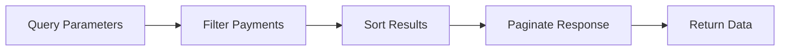

<Warning>
**AI-Generated Content** – This page was generated with AI assistance and may contain inaccuracies. While likely close to accurate, please verify critical details with the [stable documentation](https://docs.request.network) or [contact support](https://github.com/orgs/RequestNetwork/discussions).
</Warning>

## Overview

The GET /payments endpoint provides comprehensive payment search and filtering capabilities, enabling detailed payment history analysis and transaction monitoring.

## Endpoint Features

<CardGroup cols={2}>
  <Card title="Advanced Filtering" icon="filter">
    Multiple search criteria
  </Card>
  
  <Card title="Pagination" icon="list">
    Large dataset management
  </Card>
</CardGroup>

## How It Works

**Search Process:**
1. **Filter:** Apply search criteria
2. **Sort:** Order by date, amount, or status
3. **Paginate:** Handle large result sets
4. **Return:** Structured payment data

## Filter Options

### Basic Filters
- **Date Range:** Start and end dates
- **Amount Range:** Minimum and maximum amounts
- **Currency:** Specific token or fiat currency
- **Status:** Payment completion state

### Advanced Filters
- **Payer Address:** Filter by payment sender
- **Payee Address:** Filter by payment recipient
- **Transaction Hash:** Specific transaction lookup
- **Request ID:** Payments for specific requests

## Network Filtering

<CardGroup cols={2}>
  <Card title="Single Network" icon="link">
    Payments on specific blockchain
  </Card>
  
  <Card title="Multi-Network" icon="network-wired">
    Crosschain payment search
  </Card>
</CardGroup>

### Supported Networks
Filter payments across Ethereum, Polygon, Arbitrum, BSC, and other supported networks.

## Response Data

### Payment Information
- **Basic Details:** Amount, currency, timestamp
- **Network Data:** Blockchain, transaction hash, block number
- **Participants:** Payer and payee addresses
- **Status:** Confirmation state and payment completion

### Enhanced Data
- **Fee Breakdowns:** Detailed fee structure with USD amounts
- **Exchange Rates:** Historical conversion rates
- **Gas Costs:** Transaction fee information

## Pagination

Handle large datasets with cursor-based pagination for optimal performance.

## Implementation Details

See [API Reference - GET /payments](/api-reference/endpoints/get-payments) for complete technical documentation.