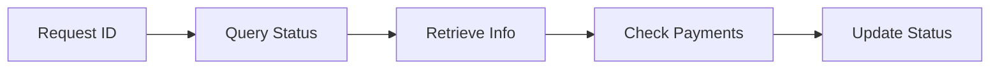

## Overview

Query requests provides comprehensive request status monitoring and information retrieval, enabling real-time tracking of payment requests throughout their lifecycle.

## Request Status Lifecycle

<CardGroup cols={2}>
  <Card title="Active States" icon="play">
    Created, pending, partially paid
  </Card>
  
  <Card title="Final States" icon="check">
    Paid, cancelled, expired
  </Card>
</CardGroup>

## How It Works

**Query Process:**
1. **Identify:** Use request ID for lookup
2. **Retrieve:** Get current request information
3. **Analyze:** Check payment status and history
4. **Update:** Reflect latest blockchain state

## Status Types

### Request States
- `created` - Request initialized and stored
- `pending` - Awaiting payment completion
- `paid` - Full payment received and confirmed
- `cancelled` - Request cancelled by creator
- `expired` - Past due date without payment

### Payment States
- `no_payment` - No payment transactions detected
- `partially_paid` - Partial payment received
- `paid` - Full payment amount received
- `overpaid` - Payment exceeds requested amount

## Query Methods

<CardGroup cols={2}>
  <Card title="Single Request" icon="magnifying-glass">
    Detailed status for specific request
  </Card>
  
  <Card title="Batch Queries" icon="list">
    Multiple request status in one call
  </Card>
</CardGroup>

### Information Retrieved
- **Basic Details:** Amount, currency, participants
- **Payment History:** Transaction details and confirmations
- **Status Timeline:** Creation, updates, completion dates
- **Network Data:** Blockchain and transaction information

## Real-time Monitoring

### Automatic Updates
Combine with [Payment Detection](/api-features/payment-detection) for automatic status updates

### Event Integration
Use [Webhooks & Events](/api-features/webhooks-events) for instant notifications

## Advanced Filtering

Filter requests by:
- **Date Range:** Creation or due date periods
- **Status:** Current request or payment state
- **Participants:** Payee or payer addresses
- **Amount Range:** Minimum and maximum values

## Used In

<CardGroup cols={2}>
  <Card title="Dashboard Apps" href="/use-cases/invoicing" icon="chart-line">
    Real-time payment tracking (see EasyInvoice demo)
  </Card>
  
  <Card title="Accounting Systems" icon="calculator">
    Invoice status reconciliation and reporting
  </Card>
  
  <Card title="Payment Detection" href="/api-features/payment-detection" icon="magnifying-glass">
    Combine with automatic payment monitoring
  </Card>
  
  <Card title="Webhooks" href="/api-features/webhooks-events" icon="webhook">
    Use webhooks instead of polling for real-time updates
  </Card>
</CardGroup>

## Implementation Details

See [API Reference - Query Requests](/api-reference/endpoints/get-request) for complete technical documentation.