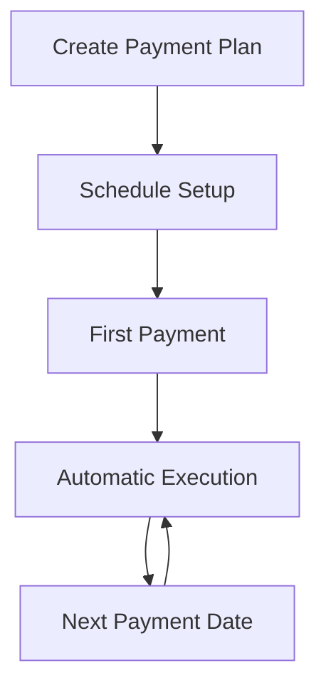

## Overview

Recurring payments enable automated payment collection on predefined schedules, supporting subscription services, installment plans, and regular business expenses.

## Payment Types

<CardGroup cols={2}>
  <Card title="Subscriptions" icon="repeat">
    Monthly/annual subscription billing
  </Card>
  
  <Card title="Recurring Payouts" icon="calendar-days">
    Scheduled payment disbursements
  </Card>
</CardGroup>

## How It Works

**Key Features:**
- **Flexible Schedules:** Daily, weekly, monthly, yearly intervals
- **Smart Contracts:** Automated execution without manual intervention
- **Fail-Safe Logic:** Retry mechanisms and payment recovery

## Configuration Options

### Schedule Types
- **Fixed Interval:** Regular payments (monthly, quarterly)
- **Custom Dates:** Specific payment dates
- **Business Days Only:** Skip weekends and holidays

### Payment Amounts
- **Fixed Amount:** Same amount each payment
- **Variable Amount:** Different amounts per payment
- **Escalation:** Automatic amount increases

## Implementation Examples

<CardGroup cols={2}>
  <Card title="SaaS Subscriptions" href="/use-cases/subscriptions" icon="laptop-code">
    Monthly software license fees with automatic billing (see EasyInvoice demo)
  </Card>
  
  <Card title="Loan Payments" icon="hand-coins">
    Structured repayment schedules with crypto settlements
  </Card>
  
  <Card title="Professional Invoicing" href="/use-cases/invoicing" icon="file-invoice">
    Combine with conversion payments for automated monthly invoices
  </Card>
  
  <Card title="Payroll Systems" href="/use-cases/payroll" icon="money-bill-wave">
    Scheduled salary disbursements and contractor payments
  </Card>
</CardGroup>

## Implementation Details

See [API Reference - Recurring Payments](/api-reference/recurring-payments) for complete technical documentation.