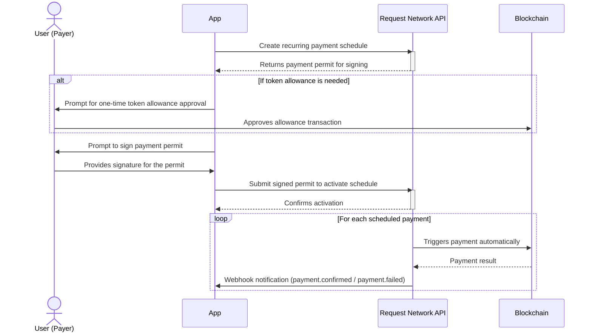

## Overview

The Recurring Payments feature allows you to create and manage subscription-like payments on the blockchain. The API handles the scheduling and triggering of these payments, providing a reliable way to automate regular transfers.

## Core functionality

- **Create Recurring Schedules:** Define a payment schedule with a start date, frequency (daily, weekly, monthly, yearly), and total number of payments. The system will generate a payment permit that encapsulates all the payment details.
- **Payer Authorization:** To authorize the payment series, the payer signs the payment permit with an EIP-712 signature. This single authorization allows the system to trigger all subsequent payments in the schedule without further interaction from the payer. For the first payment, the payer may also need to approve a token allowance for the recurring payment contract if they have not already.
- **Automated Payments:** Once the payer has authorized the schedule, Request Network API backend systems automatically trigger the payments at the specified intervals. You can rely on the API to handle the entire lifecycle of the recurring payments.
- **Status Tracking and Webhooks:** You can monitor the status of each recurring payment, including processed payments, failures, and completion status (for example active, paused, completed). Webhook notifications are sent for key events like `payment.confirmed` and `payment.failed`, allowing your application to react in real time.
- **Flexible Management:** The API provides the ability to manage the lifecycle of a recurring payment. You can cancel a recurring payment schedule to stop future payments. If a payment fails (for example due to insufficient funds), the schedule is paused, and you can unpause it once the issue is resolved. Unpausing a recurring payment after issues are resolved allows the subscription to catch up on missed payments.

## Security and Trust

Recurring payments are built on a non-custodial smart contract with several security measures to protect payer funds and ensure predictable behavior. The core principle is that all payment parameters are defined upfront and cryptographically signed by the payer, preventing unauthorized changes.

Key security features provided by the smart contract:

- **Signature-Protected Payments:** Payments cannot be triggered without a valid EIP-712 signature from the payer. The smart contract verifies the signature for every payment attempt.
- **Immutable Recipient:** The recipient address is part of the signed data. Funds can only be sent to this specified address and cannot be altered after the schedule is authorized.
- **Fixed Payment Amount:** The amount for each payment is fixed in the signed permit. The smart contract transfers only this exact amount.
- **Strict Payment Timing:** Payments cannot be triggered before their scheduled time. The contract calculates the due date for each payment and rejects premature attempts.
- **No-Repeat Payments:** The contract tracks payments, making it impossible to process the same payment more than once.
- **Enforced Payment Limit:** The total number of payments is defined in the signed permit. The smart contract enforces this limit and does not allow extra payments.
- **Sequential Payments:** Payments must be triggered in strict order (payment #1, then #2, then #3). Out-of-order attempts fail.
- **Signature Expiration:** Each recurring payment schedule has a `deadline`. If the signature expires, no further payments can be triggered.

## Recurring payment workflow


```mermaid
sequenceDiagram
    actor User as User (Payer)
    participant App
    participant API as Request Network API
    participant Blockchain

    App->>API: Create recurring payment schedule
    activate API
    API-->>App: Returns payment permit for signing
    deactivate API

    alt If token allowance is needed
        App->>User: Prompt for one-time token allowance approval
        User->>Blockchain: Approves allowance transaction
    end

    App->>User: Prompt to sign payment permit
    User->>App: Provides signature for the permit

    App->>API: Submit signed permit to activate schedule
    activate API
    API-->>App: Confirms activation
    deactivate API

    loop For each scheduled payment
        API->>Blockchain: Triggers payment automatically
        Blockchain-->>API: Payment result
        API->>App: Webhook notification (payment.confirmed / payment.failed)
    end
```

## Supported Networks

Recurring payments are supported on the following blockchain networks:

- Ethereum
- Polygon
- Arbitrum
- Gnosis
- Base
- Binance Smart Chain
- Sepolia

## Supported currencies

Recurring payments support ERC20 currencies available on the supported networks.

See [Supported Chains and Currencies](/resources/supported-chains-and-currencies).

## How it works

<Steps>
<Step title="Create a recurring payment">
Create a recurring schedule with [POST /v2/payouts](https://api.request.network/open-api/#tag/v2payouts/POST/v2/payouts).

For recurring payments, include a `recurrence` object with:

- `startDate`
- `frequency` (`DAILY`, `WEEKLY`, `MONTHLY`, `YEARLY`)
- `totalPayments`
- `payer`

The response includes a payment permit payload (EIP-712 typed data) for signature and, when required, transactions for token allowance approval.
</Step>

<Step title="Payer authorization">
The payer must:

- approve the recurring payment contract to spend the required token amount (if not already approved)
- sign the payment permit with an EIP-712 compatible wallet

```javascript
import { Wallet, providers } from "ethers";

const privateKey = "WALLET_PRIVATE_KEY";
const provider = new providers.JsonRpcProvider("RPC_URL");

const wallet = new Wallet(privateKey, provider);

const recurringPaymentPermit = ...; // from API response
const signature = await wallet._signTypedData(
  recurringPaymentPermit.domain,
  recurringPaymentPermit.types,
  recurringPaymentPermit.values,
);
```
</Step>

<Step title="Recurring payment activation">
Activate the recurring payment by submitting the permit signature with [POST /v2/payouts/recurring/{id}](https://api.request.network/open-api/#tag/v2payouts/POST/v2/payouts/recurring/{id}).

A successful response confirms activation. The schedule is now active and payments are executed automatically at the configured intervals.
</Step>

<Step title="Status monitoring">
Retrieve status, processed payments, next payment date, and related details with [GET /v2/payouts/recurring/{id}](https://api.request.network/open-api/#tag/v2payouts/GET/v2/payouts/recurring/{id}).
</Step>

<Step title="Recurring payment management">
Manage recurring payments with [PATCH /v2/payouts/recurring/{id}](https://api.request.network/open-api/#tag/v2payouts/PATCH/v2/payouts/recurring/{id}).

- **cancel**: stops all future payments
- **unpause**: resumes a paused recurring payment
</Step>
</Steps>

For full endpoint schemas and request/response examples, see [Request Network API Reference](https://api.request.network/open-api).
