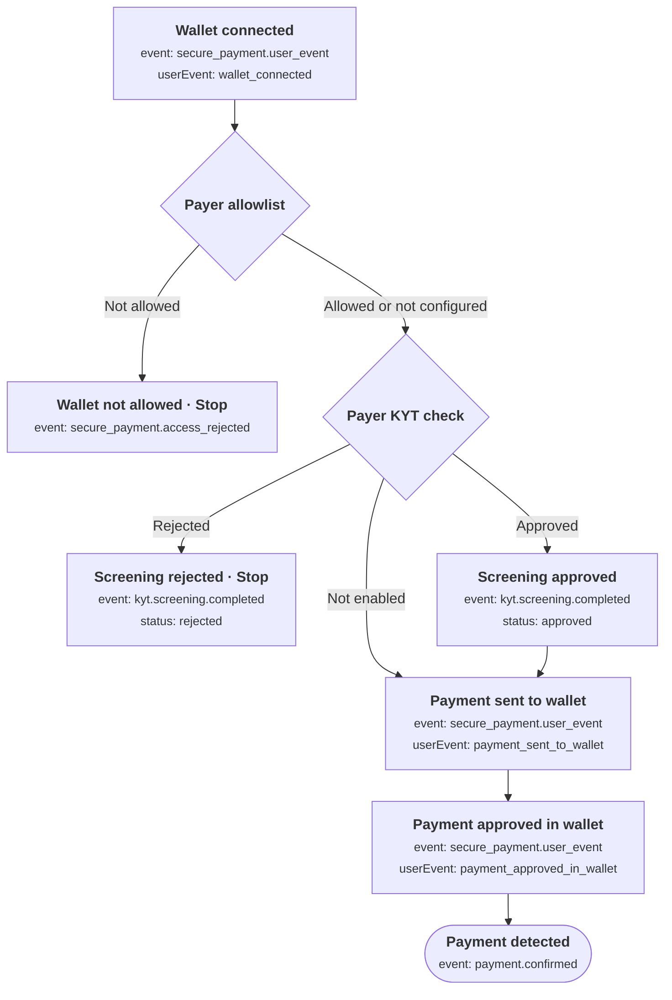
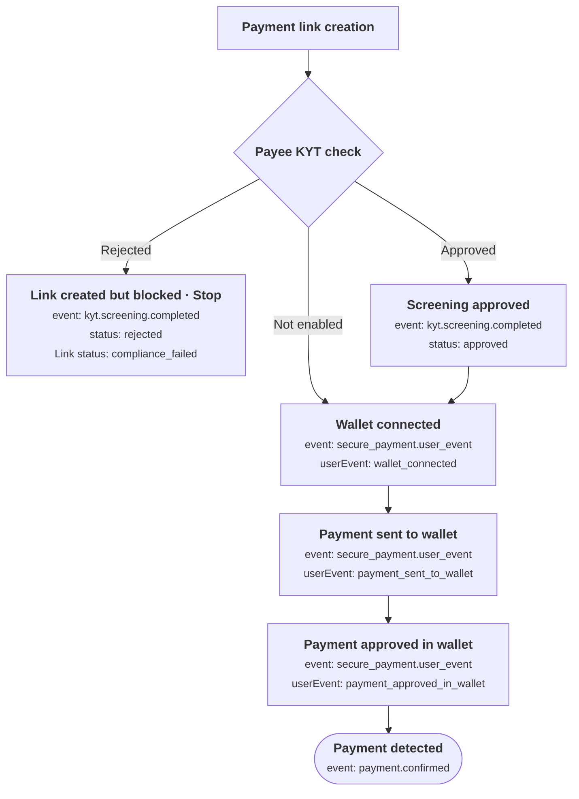

This guide covers the expected Secure Payment Page flow and the webhooks associated with each step.

<Note>
Use `payment.confirmed` to mark a payment as paid. Wallet approval and KYT approval indicate progress, not payment completion.
</Note>

## Events at a glance

| Event | Meaning |
| --- | --- |
| `secure_payment.user_event` | Checkout progress: wallet connected, payment sent to the wallet, or payment approved in the wallet. |
| `secure_payment.access_rejected` | The attempted payer is not on the payment's allowed-wallet list. |
| `kyt.screening.completed` | Screening returned `approved` or `rejected`. |
| `payment.confirmed` | Payment has been confirmed. |
| `payment.failed` | An exceptional payment failure was detected in the background. |

The checkout and screening events describe the Secure Payment flow. `payment.confirmed` and `payment.failed` are shared across Request API payment flows and are not exclusive to the Secure Payment Page.

## Incoming payment: expected flow



**Neither allowlist rejection nor KYT rejection automatically produces `payment.failed`.** They stop that wallet's attempt before payment submission. For an incoming payment, the customer may connect another permitted wallet and continue.

## Outgoing payment: expected flow

For outgoing payments, **KYT screens the payee (recipient) at link creation time**, if enabled. If the payee is rejected, **the link is still created, but cannot be used to pay**. Its status is `compliance_failed`, and opening it returns the error `SECURE_PAYMENT_COMPLIANCE_FAILED`.

The payer allowlist check applies to incoming payments only; it is not part of the current outgoing payment flow.



A rejected payee screening does not automatically produce `payment.failed`.

## When does `payment.failed` happen?

For the Secure Payment Page, `payment.failed` represents an exceptional failure in background payment processing, such as an explicit bridge failure, a failed Safe execution, or a pending Safe transaction passing its execution deadline. It is not an expected step in a successful payment.

It does not automatically fire when a customer rejects a wallet prompt, closes the page, or fails an allowlist or KYT check.

## Example webhook payloads

These examples use synthetic values and show selected fields for readability. Actual payloads may include additional information.

<AccordionGroup>
<Accordion title="Wallet connected">
```json
{
  "event": "secure_payment.user_event",
  "userEvent": "wallet_connected",
  "securePaymentToken": "example-payment-token",
  "requestId": "req_example",
  "timestamp": "2026-09-17T10:00:00.200Z"
}
```
</Accordion>

<Accordion title="Payment sent to the wallet">
```json
{
  "event": "secure_payment.user_event",
  "userEvent": "payment_sent_to_wallet",
  "securePaymentToken": "example-payment-token",
  "requestId": "req_example",
  "timestamp": "2026-09-17T10:00:05.200Z"
}
```
</Accordion>

<Accordion title="Payment approved in the wallet">
```json
{
  "event": "secure_payment.user_event",
  "userEvent": "payment_approved_in_wallet",
  "securePaymentToken": "example-payment-token",
  "requestId": "req_example",
  "timestamp": "2026-09-17T10:00:10.200Z"
}
```
</Accordion>

<Accordion title="Wallet rejected by the allowlist">
```json
{
  "event": "secure_payment.access_rejected",
  "requestId": "req_example",
  "attemptedPayerWalletAddress": "0x1111111111111111111111111111111111111111",
  "timestamp": "2026-09-17T10:00:01.000Z"
}
```
</Accordion>

<Accordion title="KYT approved">
```json
{
  "event": "kyt.screening.completed",
  "paymentToken": "example-payment-token",
  "walletAddress": "0x1111111111111111111111111111111111111111",
  "eoaAddress": "0x1111111111111111111111111111111111111111",
  "smartAccountAddress": null,
  "status": "approved",
  "provider": "hypernative",
  "policyId": null,
  "timestamp": "2026-09-17T10:00:02.000Z"
}
```
</Accordion>

<Accordion title="KYT rejected">
```json
{
  "event": "kyt.screening.completed",
  "paymentToken": "example-payment-token",
  "walletAddress": "0x1111111111111111111111111111111111111111",
  "eoaAddress": "0x1111111111111111111111111111111111111111",
  "smartAccountAddress": null,
  "status": "rejected",
  "provider": "hypernative",
  "policyId": null,
  "timestamp": "2026-09-17T10:00:02.000Z"
}
```
</Accordion>

<Accordion title="Payment confirmed">
```json
{
  "event": "payment.confirmed",
  "requestId": "req_example",
  "paymentReference": "aabbccddeeff0011",
  "amount": "10.0",
  "totalAmountPaid": "10.0",
  "expectedAmount": "10",
  "currency": "USDC",
  "paymentCurrency": "USDC",
  "network": "base",
  "txHash": "0xaaaaaaaaaaaaaaaaaaaaaaaaaaaaaaaaaaaaaaaaaaaaaaaaaaaaaaaaaaaaaaaa",
  "timestamp": "2026-09-17T10:00:20.000Z"
}
```
</Accordion>

<Accordion title="Payment failed">
```json
{
  "event": "payment.failed",
  "requestId": "req_example",
  "requestID": "req_example",
  "paymentReference": "aabbccddeeff0011",
  "payee": "0x3333333333333333333333333333333333333333",
  "subStatus": "",
  "paymentProcessor": "request-network"
}
```
</Accordion>
</AccordionGroup>

## Next steps

<CardGroup cols={2}>
  <Card title="Webhook reference" icon="webhook" href="/api-reference/webhooks">
    Configure your endpoint and check event recipients, payloads, signatures, and retries.
  </Card>
  <Card title="Secure Payment integration guide" icon="code" href="/api-features/secure-payment-integration-guide">
    Create payment links and reconcile payments with your application.
  </Card>
</CardGroup>
