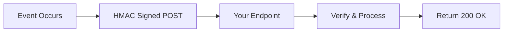

## Overview

Webhooks provide real-time notifications when payment and request events occur, enabling immediate response to status changes without constant polling.

## Event Categories

<CardGroup cols={2}>
  <Card title="Payment Events" icon="credit-card">
    **Core events:** confirmed, partial, failed, refunded

    Immediate notification when payments are processed or fail
  </Card>

  <Card title="Processing Events" icon="spinner">
    **Crypto-to-fiat:** payment.processing with detailed subStatus

    Track multi-step fiat conversion progress
  </Card>

  <Card title="Request Events" icon="file-invoice">
    **Recurring:** request.recurring

    Automatic subscription renewal generation
  </Card>

  <Card title="Compliance Events" icon="shield-check">
    **KYC & verification:** compliance.updated, payment_detail.updated

    User verification and bank account status changes
  </Card>
</CardGroup>

## How It Works

**Process:**
1. **Event occurs:** Payment confirmed, request created, compliance updated
2. **Secure delivery:** HMAC SHA-256 signed POST to your configured endpoint
3. **Your processing:** Verify `x-request-network-signature`, update application state
4. **Reliable delivery:** 3 retries (1s, 5s, 15s delays) with 5-second timeout

## Key Features

### Reliability
- **Idempotency support:** Use `x-request-network-delivery` header for duplicate detection
- **Delivery confirmation:** Monitor `x-request-network-retry-count` header to track attempts

### Security
- **HMAC SHA-256 signatures:** Every webhook includes `x-request-network-signature` header
- **HTTPS required:** Production endpoints must use secure connections
- **Test webhook identification:** `x-request-network-test` header for development

### Development Tools
- **Portal testing:** Send test webhooks from [Request Portal](https://portal.request.network)
- **ngrok integration:** Receive webhooks locally during development
- **Comprehensive logging:** Request API logs all delivery failures with attempt details

## Common Use Cases

- **Invoice systems:** Automatically mark invoices as paid when `payment.confirmed` received
- **Order fulfillment:** Release goods or services immediately after payment confirmation
- **Subscription management:** Handle `request.recurring` for automatic billing renewals
- **Compliance workflows:** Update user permissions when `compliance.updated` shows KYC approval
- **Real-time dashboards:** Display live payment status using `payment.processing` subStatus values

## Implementation

<CardGroup cols={2}>
  <Card title="Webhook Reference" href="/api-reference/webhooks" icon="code">
    Complete technical documentation with setup, payloads, and code examples
  </Card>

  <Card title="Invoicing Use Case" href="/use-cases/invoicing" icon="file-invoice">
    See webhooks in action with the EasyInvoice demo (Express.js implementation)
  </Card>

  <Card title="Request Portal" href="https://portal.request.network" icon="browser">
    Configure webhook endpoints and send test events
  </Card>

  <Card title="Payment Detection" href="/api-features/payment-detection" icon="magnifying-glass">
    Understand how webhooks work with real-time payment monitoring
  </Card>
</CardGroup>