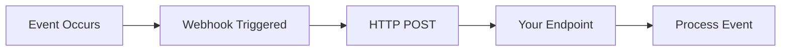

## Overview

Webhooks provide real-time notifications when payment and request events occur, enabling immediate response to status changes without polling.

## Supported Events

<CardGroup cols={2}>
  <Card title="Payment Events" icon="credit-card">
    Payment detected, confirmed, failed
  </Card>
  
  <Card title="Request Events" icon="file-invoice">
    Request created, updated, cancelled
  </Card>
</CardGroup>

## How It Works

**Flow:**
1. **Event:** Payment or request status changes
2. **Trigger:** Automatic webhook activation
3. **Delivery:** HTTP POST to your endpoint
4. **Process:** Handle event in your application

## Event Types

### Payment Events
- `payment.detected` - Payment transaction found
- `payment.confirmed` - Payment confirmed on blockchain
- `payment.failed` - Payment transaction failed

### Request Events
- `request.created` - New request created
- `request.updated` - Request information changed
- `request.cancelled` - Request cancelled by creator

## Webhook Configuration

### Endpoint Requirements
- **HTTPS Only:** Secure webhook endpoints required
- **Response Codes:** Return 200-299 for successful processing
- **Timeout:** Respond within 30 seconds

### Retry Logic
- **Automatic Retries:** Failed deliveries retried with backoff
- **Maximum Attempts:** Up to 5 retry attempts
- **Retry Schedule:** 1min, 5min, 25min, 2hr, 12hr

## Security Features

<CardGroup cols={2}>
  <Card title="Signature Verification" icon="shield-check">
    HMAC signatures for authenticity
  </Card>
  
  <Card title="IP Allowlisting" icon="network-wired">
    Restrict webhook sources
  </Card>
</CardGroup>

## Implementation Examples

See EasyInvoice webhook handling for real-world integration patterns.

## Implementation Details

See [API Reference - Webhooks](/api-reference/webhooks) for complete technical documentation.