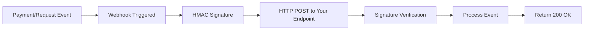

## Overview

Webhooks provide real-time notifications when payment and request events occur, enabling immediate response to status changes without constant polling.

## Event Categories

<CardGroup cols={2}>
  <Card title="Payment Events" icon="credit-card">
    Payment confirmation, processing, failures
  </Card>

  <Card title="Request Events" icon="file-invoice">
    Recurring request generation
  </Card>

  <Card title="Compliance Events" icon="shield-check">
    KYC status and bank account verification
  </Card>

  <Card title="Crypto-to-fiat Events" icon="exchange-alt">
    Offramp processing and settlement
  </Card>
</CardGroup>

## How It Works

**Process:**
1. **Event occurs:** Payment confirmed, request created, compliance updated
2. **Secure delivery:** HMAC-signed POST to your configured endpoint
3. **Your processing:** Verify signature, update application state
4. **Reliable delivery:** Automatic retries with exponential backoff

## Development Setup

### Local Testing
- **Portal testing:** Send test webhooks from Request Portal
- **ngrok integration:** Receive webhooks locally during development
- **Signature verification:** Always validate `x-request-network-signature` header

### Security Requirements
- **HTTPS endpoints only** for production webhook URLs
- **SHA-256 HMAC verification** using your webhook signing secret
- **Return 2xx status code** for successful processing (200, 201, etc.)

## Used In

<CardGroup cols={2}>
  <Card title="EasyInvoice Demo" href="/use-cases/invoicing">
    Complete webhook implementation example
  </Card>
  
  <Card title="Real-time Dashboards" href="/use-cases/checkout">
    Instant payment status updates
  </Card>
</CardGroup>

## Implementation Details

See [API Reference - Webhooks](/api-reference/webhooks) for complete technical documentation, payload schemas, and signature verification examples.