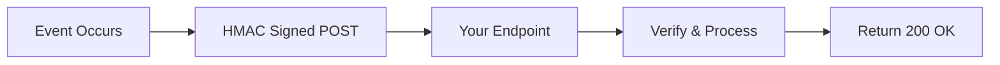

## Overview

Webhooks provide real-time notifications when payment and request events occur, enabling immediate response to status changes without constant polling.

## Event Categories

The Request Network webhook system emits **12 event types** across four categories:

| Category | Events |
| --- | --- |
| **Payment** (core) | `payment.confirmed`, `payment.partial`, `payment.failed`, `payment.refunded` |
| **Payment** (Client ID-scoped) | `payment.confirmed.client_id`, `payment.partial.client_id` |
| **Payment** (Checkout-scoped) | `payment.confirmed.checkout`, `payment.partial.checkout` |
| **Processing** (crypto-to-fiat) | `payment.processing` (with `subStatus`) |
| **Request** | `request.recurring` |
| **Compliance / Bank** | `compliance.updated`, `payment_detail.updated` |

The `.client_id` and `.checkout` variants are emitted in addition to the base `.confirmed` / `.partial` events when the request was created via a Client ID or as a checkout / secure payment, respectively. They include extra metadata (`clientId`, `origin`).

<Note>
Payment webhook payloads include `payerAddress` — the resolved payer wallet address (`null` when it can't be determined). See the [Webhooks reference](/api-reference/webhooks) for the full payload schema.
</Note>

For full payload schemas and headers, see the [Webhooks reference](/api-reference/webhooks).

## How It Works

```mermaid
graph LR
    A[Event Occurs] --> B[HMAC Signed POST]
    B --> C[Your Endpoint]
    C --> D[Verify & Process]
    D --> E[Return 200 OK]
```

**Process:**
1. **Event occurs:** Payment confirmed, request created, compliance updated
2. **Secure delivery:** HMAC SHA-256 signed POST to your configured endpoint
3. **Your processing:** Verify `x-request-network-signature`, update application state
4. **Reliable delivery:** 3 retries (1s, 5s, 15s delays) with 5-second timeout

## Key Features

### Reliability
- **Idempotency support:** Use `x-request-network-delivery` header for duplicate detection
- **Delivery confirmation:** Monitor `x-request-network-retry-count` header to track attempts

### Security
- **HMAC SHA-256 signatures:** Every webhook includes `x-request-network-signature` header
- **HTTPS required:** Production endpoints must use secure connections
- **Test webhook identification:** `x-request-network-test` header for development

### Development Tools
- **Test deliveries:** Fire test events via `POST /v1/webhook/test` (Auth API) — see [Webhooks reference](/api-reference/webhooks#testing)
- **ngrok integration:** Receive webhooks locally during development
- **Comprehensive logging:** Request API logs all delivery failures with attempt details

## Common Use Cases

- **Invoice systems:** Automatically mark invoices as paid when `payment.confirmed` received
- **Order fulfillment:** Release goods or services immediately after payment confirmation
- **Subscription management:** Handle `request.recurring` for automatic billing renewals
- **Compliance workflows:** Update user permissions when `compliance.updated` shows KYC approval
- **Real-time dashboards:** Display live payment status using `payment.processing` subStatus values

## Implementation

<CardGroup cols={2}>
  <Card title="Webhook Reference" href="/api-reference/webhooks">
    Complete technical documentation with setup, payloads, and code examples
  </Card>

  <Card title="Implementation Examples" href="/api-reference/webhooks">
    Working webhook handlers with Express.js and Next.js
  </Card>

  <Card title="Auth API webhook endpoints" href="https://auth.request.network/open-api/#tag/webhook" icon="webhook">
    POST /v1/webhook to create, GET/PUT/DELETE to manage, /test to fire test deliveries
  </Card>
</CardGroup>
