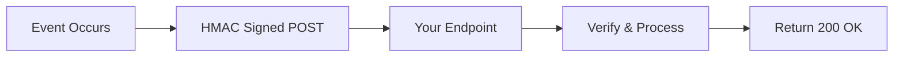

## Overview

Webhooks notify your server when Request Network processes a Secure Payment, completes KYT screening, or finishes hosted onboarding. The [Webhooks reference](/api-reference/webhooks) is the canonical guide for endpoint setup, recipients, and payloads.

## Event categories

Current Secure Payment and orchestrator integrations use these events:

| Category | Events |
| --- | --- |
| **Payment** | `payment.confirmed`, `payment.failed` |
| **KYT screening** | `kyt.screening.completed` |
| **Secure Payment Page** | `secure_payment.user_event` |
| **Payer-wallet allowlist** | `secure_payment.access_rejected` |
| **Hosted onboarding** | `client_id.linked` — a platform completes onboarding to link its Client ID to an orchestrator |

The platform's Client ID and a linked orchestrator do not receive the same events. See the [current webhook event catalog](/api-reference/webhooks#current-webhook-events) for the recipient of each event and its authentication.

### Legacy integrations

Some older API-only webhook events remain available for existing integrations. They do not apply to current Dashboard, Secure Payment Page, or orchestrator workflows. See [Legacy integrations](/api-reference/webhooks#legacy-integrations).

For full payload schemas and headers, see the [Webhooks reference](/api-reference/webhooks).

## How It Works

```mermaid
graph LR
    A[Event Occurs] --> B[HMAC Signed POST]
    B --> C[Your Endpoint]
    C --> D[Verify & Process]
    D --> E[Return 200 OK]
```

**Process:**
1. **Event occurs:** Payment confirmed, KYT screening completes, or hosted onboarding finishes
2. **Secure delivery:** HMAC SHA-256 signed POST to your configured endpoint
3. **Your processing:** Verify `x-request-network-signature`, update application state
4. **Reliable delivery:** Request Network automatically retries a failed delivery. See the [Webhooks reference](/api-reference/webhooks#retry-logic) for the delivery policy.

## Key Features

### Reliability
- **Idempotency support:** Every delivery has an ID you can use to prevent duplicate processing.
- **Automatic retries:** Request Network retries failed deliveries.

### Security
- **Signed deliveries:** Every webhook is HMAC-SHA256 signed.
- **HTTPS required:** Production endpoints must use secure connections.

### Development Tools
- **Test deliveries:** Use the relevant platform or orchestrator test endpoint to confirm your setup. Test deliveries use placeholder data, so handle them separately from real events. See the [Webhooks reference](/api-reference/webhooks).
- **ngrok integration:** Receive webhooks locally during development
- **Comprehensive logging:** Request API logs all delivery failures with attempt details

## Common Use Cases

- **Invoice systems:** Automatically mark invoices as paid when `payment.confirmed` received
- **Order fulfillment:** Release goods or services immediately after payment confirmation
- **Failed-payment handling:** Respond to `payment.failed` when payment execution fails
- **KYT workflows:** Respond to approved or rejected `kyt.screening.completed` results
- **User-event visibility:** Track wallet connection and signature progress on the Secure Payment Page via `secure_payment.user_event`
- **Payer-wallet monitoring:** Detect attempts by wallets that are not allowed to pay via `secure_payment.access_rejected`
- **Hosted onboarding:** Complete a platform's onboarding to your orchestrator after `client_id.linked`

## Implementation

<CardGroup cols={2}>
  <Card title="Webhook Reference" href="/api-reference/webhooks" icon="book">
    Endpoint setup, event recipients, payloads, and delivery behavior
  </Card>

  <Card title="Webhook reconciliation" href="/use-cases/webhook-reconciliation" icon="webhook">
    Build a signed, idempotent webhook handler
  </Card>

  <Card title="Auth API webhook endpoints" href="https://auth.request.network/open-api/#tag/webhook" icon="code">
    POST /v1/webhook to create, GET/PUT/DELETE to manage, /test to fire test deliveries
  </Card>
</CardGroup>
